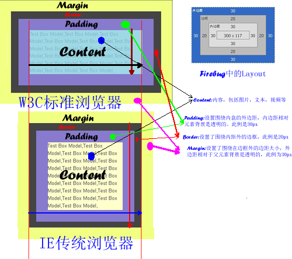

参考:
>  《精通css 第3章》  
>  W3school: [CSS 外边距合并](http://www.w3school.com.cn/css/css_margin_collapsing.asp) 
>  W3school: [CSS 定位 (Positioning)](http://www.w3school.com.cn/css/css_positioning.asp)
>  w3plus: [CSS3 Box-sizing](http://www.w3cplus.com/content/css3-box-sizing)

# 盒模型
标准盒模型(padding-box): width/height = 内容部分
IE的盒模型(border-box): width/height = 内容部分 + padding * 2

# 外边距叠加
1. 当一个元素出现在另一个元素的上面时，第一个元素的底外边距与第二个元素的顶外边距发生叠加:

2. 当一个元素包含在另一个元素中时(假设没有内边距或者边框将外边距分隔开),他们的顶或底外边距也会发生叠加:

3. 外边距甚至可以与本身发生叠加。假如有一个空元素，他有外边距，但没有边框或者内边距，在这种情况下，顶外边距与底外边距就碰到一起，会发生叠加:

如果这个外边框碰到另一个元素的外边距，还会发生叠加:

# 定位
## 一切皆为框
`div、h1` 或 `p` 元素常常被称为块级元素。这意味着这些元素显示为一块内容，即“块框”。与之相反，`span` 和 `strong` 等元素称为“行内元素”，这是因为它们的内容显示在行中，即“行内框”。
把`display`设置为`block`可以让行内元素(比如`a`)变得跟块级元素一样；`display`设置为`none`可以让生成的元素没有框，框及其所有内容不再显示，不占用文档空间；把`display`设置为`inline-block`可以让元素像行内元素一样水平地依次排列，但框的内容依然符合块级框的行为，例如能够显式地设置宽度、高度、垂直外边距和内边框。
# 定位机制
CSS中有三种基本定位机制:**普通流、浮动和绝对定位**。除非专门指定，否则所有框都在普通流定位。
行内框在一行中水平布置。可以使用水平内边距、边框和外边距调整它们的间距。但是，垂直内边距、边框和外边距不影响行内框的高度。由一行形成的水平框称为行框（`Line Box`），行框的高度总是足以容纳它包含的所有行内框。不过，设置行高可以增加这个框的高度
# 相对定位
`position`设置为`relative`，通过指定**垂直或者水平位置**，让这个元素“相对于”他的起点位置移动。比如`left`设置为`20px`会在元素左边创建`20px`的空间，也就是元素向右移动。使用相对定位的时候，**无论是否移动，元素仍然占据空间**，移动会导致它覆盖其他框。
# 绝对定位
`position`设置为`absolute`,相对定位实际上被看做普通流定位模型的一部分，因为元素的位置是相对于它在普通流的位置中。绝对定位使得元素位置与文档流无关，因此**不占据空间**。普通流文档流中其他元素的布局就像绝对定位的元素不存在时一样。
## 绝对定位位置的确定
相对于距离它最近的那个**已定位的祖先元素**确定的，如果元素没有已存在的祖先元素，那么它的位置是相对于初始包含块的。根据用户代理不同，初始包含快可能是画布或者HTML元素。
绝对定位不影响普通流的框，如果扩大绝对定位的框(比如通过增加字号)，周围的框不会重新定位。因此，尺寸的任何改变都会导致绝对定位发生重叠，从而破坏布局。
# 固定定位
`position`设置为`fixed`，是**绝对定位的一种**，差异在于固定元素的包含块是视口(`viewport`)，即使页面滚动也会一直出现在屏幕的固定位置。
# 浮动
浮动的框可以左右移动，直到他的外边缘碰到包含框或者另一个浮动的框的边缘。因为浮动框不在文档的普通流中，所以文档的普通流中的块框表现得就像浮动框不存在一样。
## 行框和清除
如果浮动元素后面有一个文档流中的元素，那么这个元素的框会表现得像浮动一样根本不存在一样。但是，框的文本内容会受到浮动元素的影响，会移动以留出空间。实际上，创建浮动框使文本可以围绕图像。
想要阻止行框围绕在浮动框的外边，需要对元素设置`clear`属性。`clear`属性的值可以是`left、right、both`或者`none`。
因为浮动元素不占据空间，所以容器元素不能包含他们。添加一个进行清空的空元素(设置`clear`)可以迫使容器元素**包围浮动元素**(**撑大**)。
### 使用伪类清除浮动
一些人使用CSS生成的内容或者JavaScript对浮动元素进行清理。对于这两种方法，需要指定清理的元素应该出现在哪里，通常需要加一个类名，比如:
``` html
<div class="news clear">
    
    <p>Some text</p>
</div>
```
结合使用:after伪类和内容声明在指定的现有内容的末尾添加内容。假如，不希望新内容占据垂直空间或者在页面上显示，需要将height设置为0，将visibility设置为hidden，因为被清理的元素在他们的顶外边距添加了空间，所以生成的内容需要将它的display设置为block。
``` css
.clear:after {
    content: "";
    height: 0;
    visibility: hidden;
    display: block;
    clear: both;
}
```