参考:
> 《计算机网路 第7版 第1章》

# 网络的网络

1. 计算机网络(简称网络)由若干`结点(node)`和链接这些结点的`链路(link)`组成。结点可以是计算机、集线器、交换机或者路由器等。
2. 网络之间可以通过路由器连起来，构成一个覆盖范围更大的计算机网络，这样的网成为`互连网`(internetwork 或 internet)，因此互连网是`网络的网络`(network of networks)。
3. 网络把许多计算机连接在一起，而互连网则把许多网络通过路由器连接在一起。与网络相连的计算机通常成为`主机`(host)。

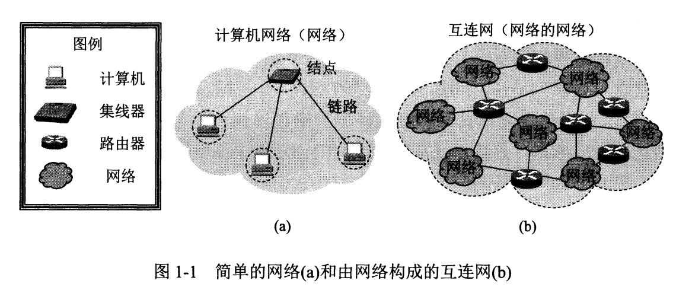

# ISP

1. 互连网服务提供者ISP(Internet Service Provider)，在许多情况下，ISP就是一个进行商业活动的公司，因此ISP又常译成互连网服务提供商。比如中国联通、中国电信。
2. ISP可以从互联网管理机构申请到很多IP，同时拥有通信线路以及路由器等连接设备，因此任何机构只要向某个ISP交纳规定的费用，就可以从该ISP获取所需IP地址的使用权，并通过ISP接入到互联网，也就是上网。
3. ISP也分为不同层次的ISP: 主干ISP、地区ISP和本地ISP。
4. 从原理上讲，只要每一个本地ISP都安装了路由器连接到某个地区的ISP，而每一个地区的ISP也有路由器连接到主干ISP，那么在这些相互连接的ISP的共同合作下，就可以完成互连网中的所有分组转发任务。
5. 互连网交换点IXP(Internet eXchange Point)的主要作用是允许两个网络直接相连并交换分组，而不需要通过三个网络来转发分组。

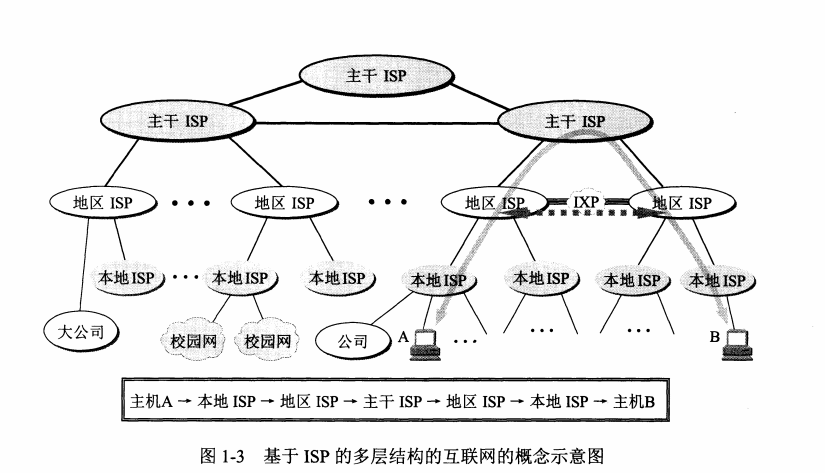

# 互联网组成

从工作方式上可以划分成两大块:
1. 边缘部分。有所有连接在互联网上的`主机`组成，这部分是`用户直接使用`的，用来进行通信(传送数据、音频或者视频)和资源共享。
2. 核心部分。有大量网络和连接这些网络上的`路由器`组成，这部分是为`边缘部分`提供服务的。

## 边缘部分

### 端系统: 
1. 处在互联网边缘的部分是连接在`互联网上的所有的主机`，这些主机又称为`端`系统。
2. 端系统的拥有者可以是人，可以是单位，也可以是某个ISP(ISP不仅是向端系统提供服务，它也可以拥有一些端系统)。

### 计算机之间的通信:

主机A的某个进程与主机B的另一个进程进行通信，通常简称为"计算机之间的通信"。

通信方式可以划分为两大类: 
1. `客户-服务器`方式(C/S方式): 客户(client)和服务器(server)都是指通信中锁涉及的两个应用进程。客户-服务器方式所描述的是进城之间的服务和被服务的关系。
2. `对等`方式(P2P方式): 指两台主机之间通信时并不区分哪一个是服务请求方哪一个是服务提供方。

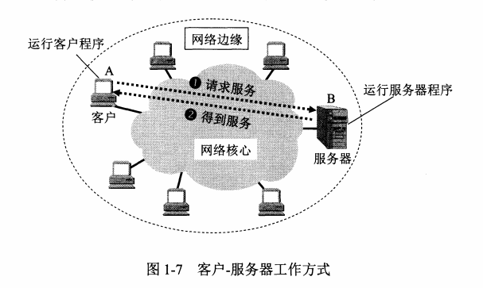
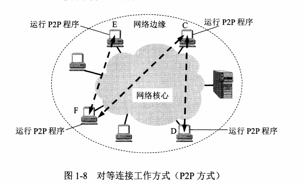

# 电路交换

1. 在通信资源的分配角度来看，交换就是按照某种方式动态地分配传输线路的资源。在使用电路交换通话之前，必须先拨号请求建立连接，这条连接是一条`专用的物理通路`。
2. 电路交换过程: 建立连接(占用通信资源) -> 通话(一直占用通信资源) -> 释放连接(归还通信资源)。
3. 电路交换重要特点: 在通话的全部时间内，通话的两个用户`始终占用端`到端的通信资源。
4. 使用电路交换来传输数据的时候，线路的`传输效率`往往`很低`。因为计算机数据是突发式地出现在传输线路上的，线路上真正用来传输数据的时间往往不到10%甚至1%。

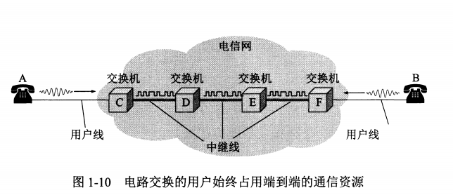

# 分组交换

1. 分组交换采用`存储转发`技术，把一个`报文`(message)划分为几个`分组`然后在进行传送。发送报文前，把报文`划分`成一个个`更小的等长数据段`，并且在每个数据段前面加上必要控制信息组成的首部(header)后，构成一个分组(packet)。分组又称为"包"，分组的首部又被称为"包头"。
2. 分组是互联网中传送的数据单元。分组中"首部"很重要，因为它包含了目的地址和源地址等重要控制信息，这样每一个分组才能在互联网中独立地选择传输路径，并被正确地交付到分组传输的终点。

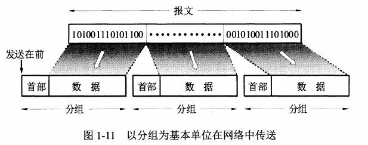

1. 分组交换优点:
  - 高效: 在分组传输过程中`动态分配`传输带宽，对通信链路`逐条占用`。
  - 灵活: 为每一个分组`独立地选择最合适`的转发路由。
  - 迅速: 以分组作为传送单位，`可以不先建立链接`就能向其他主机发送分组。
  - 可靠: 保证可靠性的网络协议。`分布式多路由交换分组网`，使网络有很好的生存性。
2. 带来的问题: 分组交换在各路由器转发储存时需要排队，会造成一定的`时延`。另一个问题是个`分组携带控制信息`也会造成一定的`开销`(overload)，整个分组交换网还需要专门的管理和控制机制。

# 报文交换

20世纪40年代的电报通信也是基于`储存转发`原理的报文交换。在报文交换中心，一份电报接收下来，并穿成纸带，操作员以每份`报文`为单位，撕下纸带，根据报文`目的站地址`，拿到相应的发报机`转发`出去。

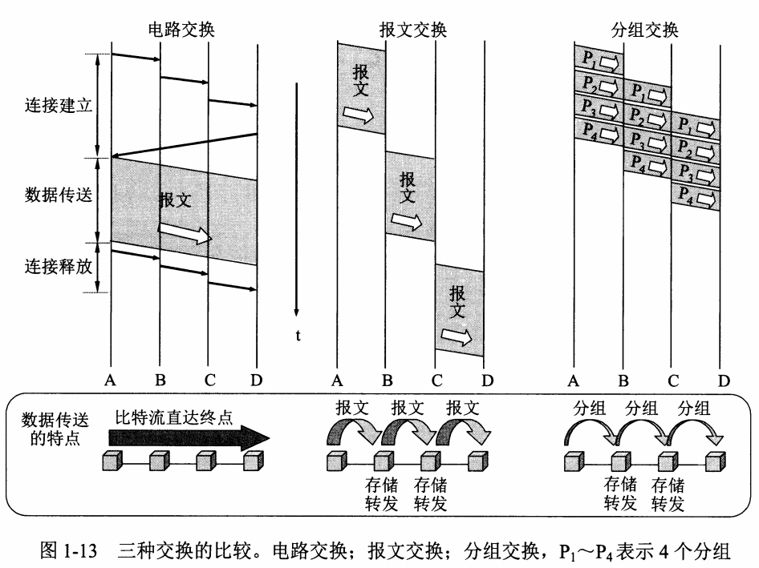

# 计算机网络性能指标

## 速率

`比特`(bit)是信息论中使用的信息量的单位，网络中的速率指的是数据的传送速率，也成为数据率(data rate)或者比特率(bit rate), 是计算机网络一个重要的性能指标，速率单位是`bit/s`(比特每秒, b/s, bps)。通常提到网络速率时，指的是`额定速率`或者`标称速率`，而非网络实际运行速率。比如: 40Gbit/s。

## 带宽

带宽(bandwidth)是指某个`信号`具有的频带宽度, 带宽的单位是`赫兹`。在计算机`网络`中，带宽用来表示某通道`传送数据的能力`, 即单位时间内网络中某信道所能通过的"最高数据率", 此时带宽的单位, 也就是数据率的单位是bit/s(比特每秒)。

## 吞吐量

吞吐量(throughput)表示`单位时间`内通过某个网络(或者信道、接口)的`实际数据量`。吞吐量受网络的带宽或者网络的额定速率限制。比如一个1Gbit/s的以太网，额定速率是1Gbit/s,这个数值是吞吐量上限，但实际吞吐量可能只有100Mbit/s,或者更低。

## 时延

时延是指数据(一个报文或者分组，甚至比特)从网络(或者链路)的一端到另一端所需时间，通常也被称为延迟或者迟延。

1. 发送时延(transmission delay), 是`主机或路由器`发送数据帧所需的时间, 也就是从发送数据帧的第一个到最后一个比特发送完毕所需的时间, 也叫传输时延。
计算公式: 发送时延 = 数据帧长度(bit)/发送速率(bit/s)
2. 传播时延(propagation delay), 是`电磁波在信道中`传播一定距离所需浪费的时间。
计算公式: 传播时延 = 信道长度(m) / 电磁波在信道上的传播速率(m/s)
3. 处理时延, `主机或者路由器`在收到分组时需要花费一定时间进行处理,这就产生了处理时延。
4. 排队时延, `分组`在经过网络传输时, 要经过许多`路由器`，分组进入路由器之后要先在输入队列中排队等候处理，这就产生了排队时延, 取决于网络当时的通信量。

数据在网络中经历的总时延是以上四种时延之和:
总时延 = 发送时延 + 传播时延 + 处理时延 + 排队时延

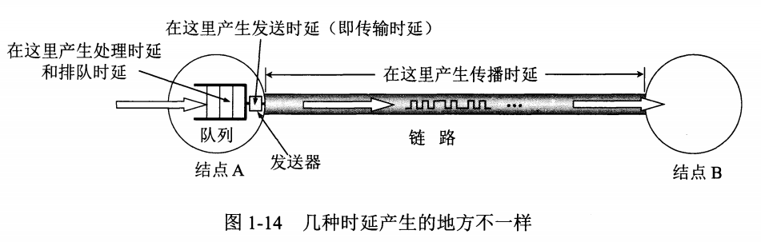

## 时延带宽积

时延带宽积 = 传播时延 x 带宽, 链路的时延带宽积又被称为`以比特位单位的链路长度`。

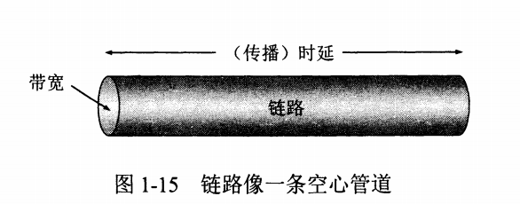

## 往返时间 RTT

例如: A向B发送数据，如果数据长度为100MB，发送速率为100Mbit/s,则
发送时间 = 数据长度 / 发送速率 = 100 x 2^20 * 8 / 100 x 10 * 6

如果B正确收完100MB数据后，就立即向A发送确认。再假定A只有在收到B的确认信息后，才能继续向B发送数据，显然这时需要一个往返时间RTT(假定确认信息很短，可以忽略)。如果RTT = 2s，则可以算出A向B发送数据的有效数据率。
有效数据率 = 数据长度 / (发送时间 + RTT) = 100 * 2^20 * 8 / (8.39 + 2)

## 利用率

利用率有信道利用率和网络利用率两种。信道利用率指出某信道有百分之几的时间是被利用的，完全空闲的信道利用率是0;网络利用率是全网络信道利用率加权平均值。信道利用率并非越高越好, 根据排队论的理论, 当某信道利用率增大时, 该信道引起的时延会增加。
如果令D0表示网络空闲时的时延，D表示网络当前的时延，U表示利用率，那么在适当的假定条件下，可以用公式表示: D = D0 / (1 - U)

# 计算机网络体系结构

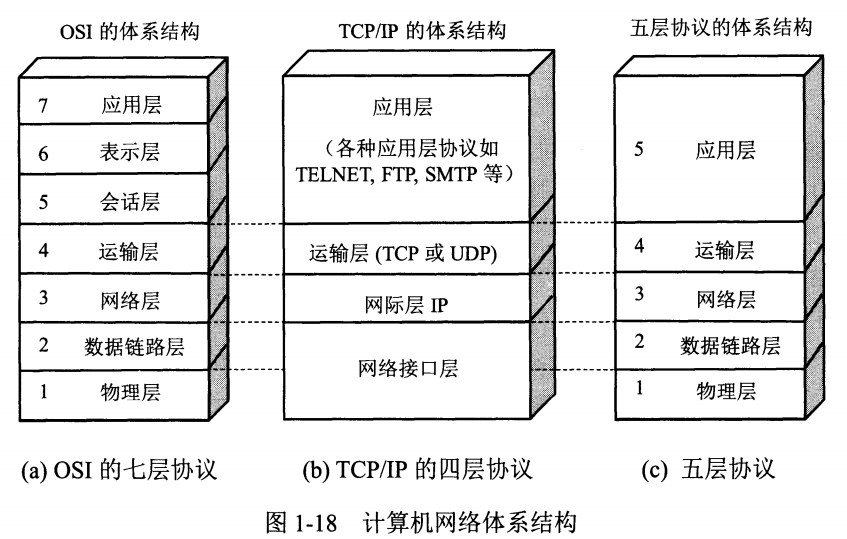

1. 五层协议

- 应用层(application layer): 是体系结构中的最高层, 它的任务是`通过应用进程间的交互来完成特定的网络应用`。应用层协议定义的是`应用进程间通信和交互的规则`，进程指的是`主机正在运行的程序`。不同的网络应用需要不同的应用层协议，比如: DNS、HTTP协议、SMTP等。应用层交互的数据单元被称为`报文`(message)。
- 运输层(transport layer): 它的任务是`负责向两台主机进城之间的通信提供通用的数据传输服务`。应用层利用该服务`传送应用报文`。运输层主要包含两种协议: 传输控制协议`TCP`(Transmission Control Protocol),提供面向连接的,可靠的数据传输服务,其数据传输的单位是`报文段`(segment);用户数据报协议`UDP`(User Datagram Protocol),提供无连接的、`尽最大努力`(best-effort)的数据传输服务(不保证数据传输的可靠性),其数据传输的单位是`用户数据报`。
- 网络层(network layer): 它负责为分组交换网上的不同主机提供通信服务。在发送数据时，网络层把运输层产生的报文段或者用户数据报封装成分组或者包进行传送。在TCP/IP体系中，由于网络层使用IP协议，所以分组也叫IP数据报，或者数据报。
- 数据链路层(data link layer): 也叫链路层。两台主机之间的数据传输，总在一段一段的链路上传送,这时需要专门的链路层的协议。在相邻两结点传输数据时，数据链路层将`网络层`交下的`IP数据报`组装成`帧`(framing),在两相邻结点间的链路上`传送帧`(frame),每一帧包含数据和必要的控制信息。
- 物理层(pysical layer): 物理层传送的数据单位是比特,它考虑的是如何传输比特流,当然，解释比特代表的意思就不是物理层的任务了。

2. OSI(开放系统互连基本参考模型)

- 表示层(presentation Layer): 表示层向上对应用层服务，向下接受来自会话层的服务。表示层为在应用过程之间传送的信息提供表示方法的服务，它只关心信息发出的语法和语义。表示层是处理所有与数据表示及运输有关的问题，包括转换、加密和压缩。
- 会话层(session layer): 是建立在传输层之上，利用传输层提供的服务，使应用建立和维持会话，并能使会话获得同步。

3. TCP/IP

TCP/IP只有四层,它最高只用到了网络层而没有运输层和应用层。

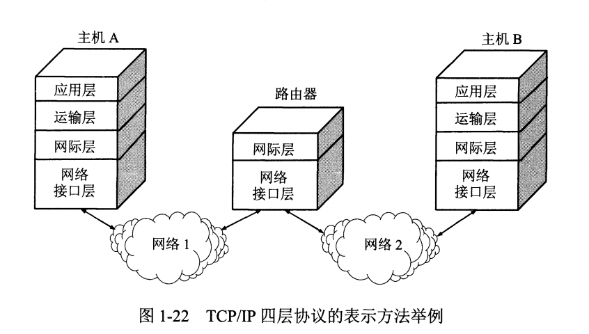

它并不严格遵循严OSI分层的概念。

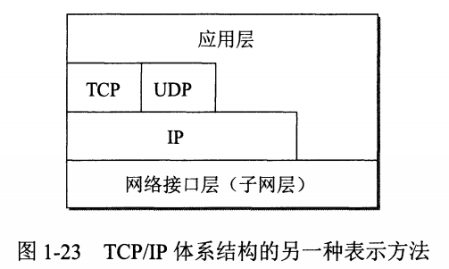

TCP/IP协议族上下两头大而中间小,像沙漏计时器形状,可以提供各式各样的应用提供服务,同时TCP/IP允许IP协议在各式各样的网络构成的互联网上运行。

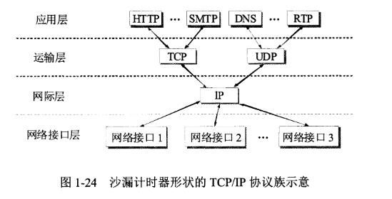

